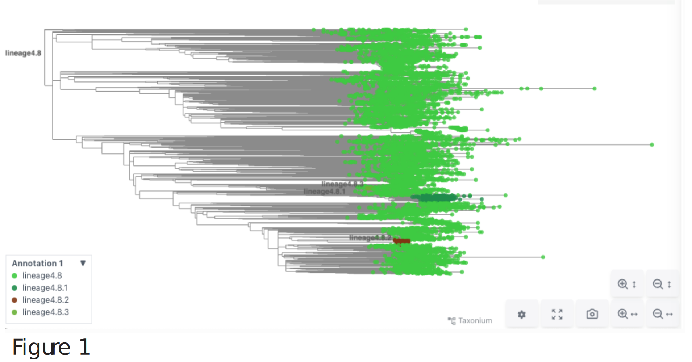
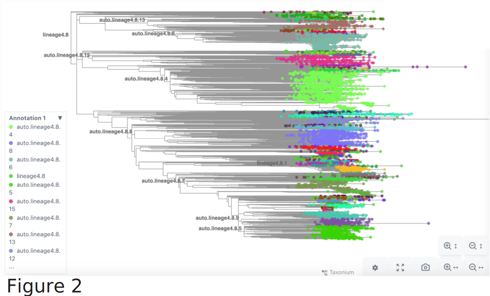

Import propose_sublineages.py from https://github.com/jmcbroome/autolin (commit 32d9a52)

### Example Demonstration
As a beginner example, as well as proof of concept, we have extracted the XFG clade from the SARS-CoV-2 global phylogeny using the command `matUtils extract -i public-latest.all.masked.pb.gz -c XFG -o XFG.pb` and lineage4.8 from the MTB global phylogeny using `matUtils extract -i {mtb tree} -c lineage4.8 -o {4.8 output}`. 

Note to user: The SARS-CoV-2 global phylogeny is annotated on the nodes using matUtils annotate. The original tree has both nextstrain and pango annotations resulting in 2 labels on certain internal nodes. Autolin is performing strangely on the dual-annotated tree. To combat this issue, I have reannotated the tree wih only a single annotation. The commands I used are as follows:
`matUtils extract -i public-latest.all.masked.pb.gz -c XFG -o XFG.pb`
`matUtils summary -i XFG.pb -C XFG.clades`
`cut -f1,3 XFG.clades > XFGclades.pangoonly.tsv`
`awk '{print $2 "\t" $1}' XFGclades.pangoonly.tsv > XFGclades.pangoonly.fixed.tsv`
`matUtils annotate -i XFG.pb -l -c XFGclades.pangoonly.fixed.tsv -o XFG.pangoonly.pb`
`py convert_autolinpb_totax.py -a XFG.pangoonly.pb `

For the moment, if a SARS-CoV-2 file with dual annotations is used for any of these scripts it will fail with an error message. Use XFG.pangoonly.pb or use my above commands to get a SARS-CoV-2 tree with only pango annotations. 

### Getting started
To generate autolin designations, the software takes as input a Mutation Annotated Tree (MAT) in protcol buffer format. Instruction on creating a MAT can be found at https://usher-wiki.readthedocs.io/en/latest/UShER.html#methodology. 

In it's most basic iteration, autolin can be run with the command `python3 propose_sublineages.py -i {name of MAT}` however, several considerations must be taken into account for quality automated lineage designations. 

First, many pathogens have existing lineage/strain naming conventions that are already standing, and working with these existing conventions is likely the most appropriate way to move forward with further lineage names. For this reason, inputting a MAT with annotated nodes is more useful for certain pathogens. Instructions on annotating a MAT can also be found within the UShER documentation. Annotated MATs for certain pathogens such as M. tuberculosis and SARS-CoV-2 are available at https://hgdownload.gi.ucsc.edu/hubs/GCF/000/195/955/GCF_000195955.2/UShER_Mtb_SRA/ and https://hgdownload.soe.ucsc.edu/goldenPath/wuhCor1/UShER_SARS-CoV-2/. ** NOTE!!! although matUtils annotate and autolin are capable of handling MATs with more than 1 annotation per node, we strongly advise against using MATs with more than 1 annotation per node. Much of our additional tools assume 1 annotation and will raise an error with more than 1. 

Please note that running `python3 propose_sublineages.py -i {name of MAT}` on the annotated global phylogenies of M. tuberculosis and ESPECIALLY SARS-CoV-2 may result in significant run times as there are many existing lineages and sublineages that would all be examined for their potential sublineage designations. For this reason, large, well-annotated pathogens will likely require intentional targeting of clades of interest (see below for details). 

To create meaningful annotations on top of existing conventions, and to tailor lineage annotations to specific pathogens, certain flags in the propose_sublineages.py program will assist in creating better, more customized designations. 

The autolin algorithm is not intended to overwrite any existing lineages and will seek to create meaningful, unbiased suggestions to replace manual inspection and designation of lineage splits.

### Using arguments to improve lineage designations

As noted above, for global phylogenies, a general approach of identifying all potential new annotations for an entire tree will be computationally expensive for well-annotated global phylogenies. Most notably, SARS-CoV-2 has 4864 existing clade labels and querying all of these for new lineage designations is time-consuming and not necessarily valuable as certain lineages are older and less relevant currently. 

*add helper script for querying metadata for newer lineages or samples* 

`--annotation` or `-a` allow for users to select clade names that they specifically are interested in proposing sublineages for. (Note that `-a` will only work if the MAT is annotated and the user makes a direct call to an existing annotation)

For example: If user wants to annotate lineage XFG in the SARS-CoV-2 global phlyogeny, the MAT can be retrieved with `wget http://hgdownload.soe.ucsc.edu/goldenPath/wuhCor1/UShER_SARS-CoV-2/public-latest.all.masked.pb.gz` and the command `python3 propose_sublineages.py -i public-latest.all.masked.pb.gz -a XFG`

*maybe make a helper fucntion to determine how long a particular predicton will make?*

Tip: using `matUtils summary -i {name of tree } -c clades.tsv` the user can receive a list of clades and the number of sublineages within that clade which can be used to choose more specific clades, and avoid choosing very large clades. 

the `--recursive` (`-r`) flag, when called, will initiate a recursive employment of the autolin algorithm, and will designate sublineages of the lineages suggested by autolin, allowing for several layers of designation. To prevent the splitting of sublineages into N=1 size, the `-m` or `--minsamples` command requires that each lineage carry at least m sample weight (without special weighting, m is equivalent to minimum number of samples assigned to a lineage)(default m is 10). `-m` is usable with or without `-r` but is especially important when recursive rounds of lineage designation are employed. SEE EXAMPLE BELOW

the `--mutweights` or `-w` flag acknowledges that certain mutations may not contribute as meaningful of changes to an organism and that certain mutations should be weighted more strongly in their consideration of differences between samples in the same taxa. *to add: helper script for identifying n/ns mutations and prescribing weights to them. also: potentially for certain pathogens weighting certain regions higher. also: potentially hypermutation mutations.*

the `--samples` or `-p` flag is intended to be used for weighting samples associated with certain phenotypes. For example, in MTB, samples with predicted or observed antibiotic resistance can be weighted more heavily in the designation of new lineages. SEE EXAMPLE BELOW

### Lineage designation examples
As an example, we have extracted a subtree of lineage4.8 from the MTB global phylogeny. The original file is available in the repository as `mtb.4.8.pb` and it's visual without autolin designations is available as `mtb.4.8.jsonl.gz`. 
We have also extracted a subtree of XFG from the SARS-CoV-2 global phylogeny. This example is available in the repo as `XFG.pangoonly.pb` and it's visual without autolin designations is available as `XFG.pangoonly.jsonl.gz`.

#### mtb.4.8 autolin settings 
The most basic command to designate new lineages within `mtb.4.8.pb` is `python3 propose_sublineages.py -i mtb.4.8.pb -o mtb.4.8.autolin.pb`. The results of this can be observed in `mtb.4.8.autolin.jsonl.gz`. To generate recursive sublineages the command is `python3 propose_sublineages.py -i mtb.4.8.pb -r -o mtb.4.8.autolin.r.pb` which relies on a default `-m` setting of 10 and results in lineages as shown in `mtb.4.8.autolin.r.jsonl.gz`. The resulting clades and their sizes can be viewed with `matUtils summary -i mtb.4.8.autolin.r.pb -c mtb.4.8.autolin.r.cladecounts.tsv` and `-m` can be toggled according to user needs. Lower `-m` values will increase the number of proposed sublineages and decrease the number of samples in a proposed sublineage. 

#### Identifying phenotypes for weighting in MTB
As an example of how to use phenotypic weighting for consideration in autolin, we have created a helper script that accepts as input an annotated phylogeny and a metadata table containing predicted or observed antibiotic resistance information. This script employs an ordinal weighting scheme based on drug resistance characterized by the WHO (https://wwwnc.cdc.gov/eid/article/28/9/22-0458_article).  

To use this script, an annotated MAT and its corresponding metadata file is required. For this demonstration we use `mtb.4.8.pb` and `mtb.20250912.metadata.tsv.gz` which can be downloaded from https://hgdownload.gi.ucsc.edu/hubs/GCF/000/195/955/GCF_000195955.2/UShER_Mtb_SRA/. **NOTE this script assumes that it is being run from the `autolin` directory and will write outputs to this dir.** *Future versions will be more adaptable.* **Note this script hardcodes output names, if data currently exists in these files it will be overwritten by the newest run of the code** *future versions will avoid overwriting existing data*

Currently the way this script runs is with the command `py phenotypes.py -m {metadata file containing a column of predicted or pbserved resistance type (i.e. RR-TB, HR-TB, MDR-TB, etc} -t {name of MAT}  -c {name of column containing categorical resistance types} -o {output}`. For us the command was as follows: `py phenotypes.py -m mtb.20240912.metadata.tsv.gz -t mtb.4.8.pb  -c tbprof_drtype -o phenotypeweights.tsv`

This script is assuming categorical data either from TB profiler or another source. The data is ranked from lowest to highest:["Sensitive", "HR-TB", "RR-TB", "MDR-TB", "Pre-XDR-TB", "XDR-TB"]. Any data outside of these categories will be given a weight of 0.5 while these categories will recieve equally distributed weights between 0 and 1. If your data is not in this format this script is not going to work. 

The user-named output file will contain 3 columns: `Sample`, `Weight`, and `Phenotype`. However, the script will generate 2 additional files: `pheno.pheno.tsv` and `pheno.weights.tsv` which are 2 column files which both contain sample ID in the first column and phenotypes or samples weights respectively in the second column. After running phenotypes.py, autolin designations can be made using `py propose_sublineages.py -i mtb.4.8.pb -p pheno.weights.tsv -o mtb.4.8.pheno.pb` (with user arg choices after the flags.)

Once the output of `autolin -p` is available (in this case`mtb.4.8.pheno.pb`) there are a couple of ways to make this data viewable in taxonium. SEE `Getting lineage designations into Taxonium` below for details. 

#### Demonstrated efficacy of phenotype weighting as shown in MTB lineage4.8

Linolium improves the biological relevance of AutoLin lineage suggestions by allowing the user to identify important metadata features that should be weighted more heavily in automated lineage assignment. 

Although AutoLin was already capable of accepting predetermined weights for samples, the user was wholly responsible for determining those weights. Our novel contributions to AutoLin allow for a user to choose metadata features for weighting without making weighting decisions for each sample in the tree. 

Although there is no objective ground truth to new lineage designations, we show that feature weighting does provide more intuitive lineage suggestions that support the continuation of biologically relevant clade groupings downstream. 

As an example of the work possible with our tool, we use Mycobacterium tuberculosis lineage 4.8 (Figure 1).

{width=90%}

Lineage 4.8 has 8262 samples and only 3 small sublineage designations that identify biologically similar samples within the clade (Figure1). Without phenotypic feature weighting, AutoLin suggests 67 sublineages (71 total lineages including 4 pre-existing) () with average clade size 116.37 and clade size standard deviation 204.96. 

{width=90%}

*Future steps: use RAND index to characterize lineages proposed from phenotype weighting*

#### Identifying mutations for weighting in SARS-CoV-2
*to do asap*

####

### Getting lineage designations into Taxonium
To create a file for visualization in Taxonium users should use the `-o` or `--output` flag in propose_sublineages.py. Supply an output MAT name `{your tree}autolin.pb`. This output file will have both existing and proposed autolin annotations on the internal nodes. To convert this file into a `jsonl.gz` type for taxonium, use usher_to_taxonium which is available in TaxoniumTools https://github.com/theosanderson/taxonium/tree/master/taxoniumtools. 

To assist in the conversion between the autolin outputted pb and the taxonium input jsonl.gz, `convert_autolinpb_totax.py` will take the name of the autolin pb with `-a` and output a `.jsonl.gz` which can be used for viewing newly proposed lineages.

**note `convert_autolinpb_totax.py` currently assumes that the pb has only one annotation scheme. Using the SARS-CoV-2 in its existing global form will cause errors.**
*Note: these scripts will be refined and likely turned into a snakemake pipeline in future releases.*

To run `convert_autolinpb_totax.py` all that is needed is an autolin annotated pb. The basic command is `py convert_autolinpb_totax.py -a {autolin.pb}`. This script will additionally accept a metadata file for the MAT that was annotated by autolin. 

To add metadata to the taxonium file use the flag `-amd` or `--additional-metadata`. For example, to include the phenotypic drug resistance classifications for mtb.4.8.pheno.pb the command `py convert_autolinpb_totax.py -a mtb.4.8.pheno.pb -amd pheno.pheno.tsv` will generate `mtb.4.8.pheno.jsonl.gz` which will contain metadata for existing and autolin designations and drug resistance. If the full set of metadata associated with the data set is desired `-amd` will take a gzipped tsv as well such as in `py convert_autolinpb_totax.py -a mtb.4.8.pheno.pb -amd mtb.20240912.metadata.tsv.gz` which will also output a file named `mtb.4.8.pheno.jsonl.gz`. 

**Note that .jsonl.gz output files have the same suffix as the input pb. Existing files will be overwritten if they carry the same name**

*Future versions of this will create options for tmp files and other ways to avoid potential overwriting*

Notes on usher_to_taxonium:
usher_to_taxonium has sparse documentation and many hardcoded quirks. Users can use usher_to_taxonium directly but will very likely experience formatting issues. We recommend using convert_autolinpb_totax.py.

