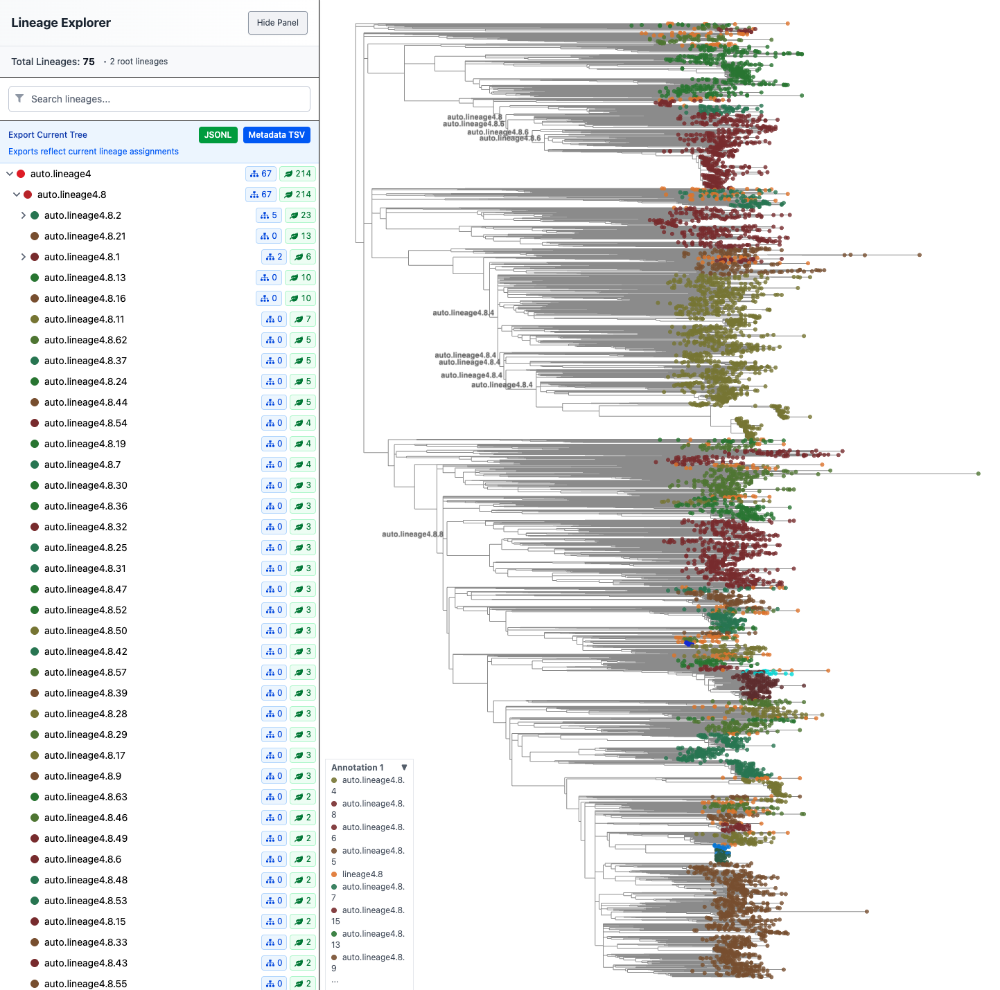

# Summary 

In public health, pathogen lineage designation is the process of identifying distinct groups within a species which is essential for tracking the transmission of infections and informing treatment strategies[@McBroome2024-wo]. Linolium is an end-to-end containerized workflow for assigning and exploring lineage designations for pathogens using genomic data. It orchestrates lineage inference, metadata integration, and browser-based review within a single reproducible environment. Linolium enables users to assign, inspect, and refine lineage systems using genomic data represented in Mutation Annotated Tree (MAT) format[@Turakhia2021-xn], supporting both established nomenclatures and the development of new lineage systems. 

# Statement of need

Recent surges in pathogen sequence availability have challenged existing methods of lineage detection and curation. Pathogen surveillance methods developed during the SARS-CoV-2 pandemic, including wastewater-based tracking [@Gangwar2025-ph;@Karthikeyan2022-cc], have catalyzed a transition toward high-volume sequencing. Yet, this abundance of data has exposed a bottleneck in our ability to maintain up to date lineages and identify emerging threats, necessitating a more standardized and scalable approach to pathogen genomics. Existing tools address lineage identification and phylogenetic visualization separately, requiring users to manually connect outputs across workflows.

While our research group previously developed individual tools for these tasks[@McBroome2024-wo;McBroome2021-zx;Sanderson2022-ft;@Turakhia2021-xn;noauthor_undated-vt], users must still navigate fragmented processes to achieve a full analysis. Linolium addresses this gap by automating the multi-tool requirements of lineage designation, as well as contributing specialized visualization and data handling into a streamlined environment. Designed for public health researchers, this tool reduces the manual coordination typically required for large pathogen datasets by integrating inference and curation steps. Linolium combines existing lineage designation and visualization tools and introduces metadata-aware lineage scoring within a unified workflow. The tool lowers technical barriers by encapsulating dependencies and managing intermediate data automatically.

# State of the field

Pathogen lineage designation is a decentralized process across many pathogen-specific nomenclatures[@Hill2024-iq;@Kuhn2014-xv;@Lancefield1933-tw;@OToole2021-gu;OToole2022-dl;@Ramaekers2020-my;@Rambaut2020-kn;Schneider2019-ph;@Seabra2022-kg] and a manual suggestion and curation process which is time-consuming and biased by human opinion[@Focosi2023-yz;@McBroome2024-wo]. In response to pandemic level sequencing, new tools such as AutoLin and Taxonium were developed which assist with elements of the lineage identification process such as candidate lineage identification and phylogenetic visualization.  Despite the development of these tools, there was no tool which supported the identification of new lineages from beginning to end. Linolium orchestrates AutoLin[@McBroome2024-wo], TaxoniumTools[@noauthor_undated-vt], and Taxonium[@Sanderson2022-ft], managing dependencies and intermediate data while extending AutoLin with metadata-weighted lineage scoring and integrating interactive curation.  Linolium consolidates existing lineage designation and visualization tools into a unified workflow for automated and interactive lineage curation. 

AutoLin is a pathogen-agnostic software tool which assists in automated, efficient, and  phylogenetic-based lineage designation for faster identification of differentiation within species[@McBroome2024-wo]. While AutoLin is highly versatile and scalable across various pathogens, it lacks a function to weight phenotypes defined in metadata which would provide more biologically informed lineage suggestions. Linolium adds additional parameters to AutoLin that allow the user to improve the biological relevance of the proposed lineages (see ./autolin/README.md). 

Taxonium is a web-based, interactive visualization tool for large (>10M samples) phylogenetic trees and associated metadata[@Sanderson2022-ft]. The original Taxonium tool is capable of displaying lineage information for nodes within a phylogeny but lacks the ability to identify AutoLin suggested lineages and curate this information interactively. The Linolium implementation of Taxonium has a new user interface that specifically identifies AutoLin outputs and allows for immediate review of the proposed new lineages. 

Conversion of data across this analysis requires TaxoniumTools, a useful but technical tool that translates phylogenetic tree files into Taxonium readable files. Because TaxoniumTools has many features and specific use cases that require advanced knowledge and significantly increase technical overhead, Linolium replaces user interaction with this tool, handling all necessary inputs and outputs to convert informational results into interpretable visualizations with no additional commands.

# Software Design

Linolium is a containerized workflow that connects analysis, conversion, and visualization tools. While AutoLin and Taxonium are effective independently, their lack of integration necessitates significant manual data transformation and multiple command-line steps. We integrated these tools within a Docker container to ensure reproducibility and simplify dependency management across heterogeneous computing environments common in public health genomics.

Rather than developing competing software, we chose to build upon existing open-source tools to improve their efficiency and biological relevance. Linolium uses data formats and tools that are well documented and commonly used to build on existing frameworks and provide reliable results. All of its analyses and visualizations are built around the UShER Mutation Annotated Tree (MAT) format[@Turakhia2021-xn], which has become widely used in public health applications, tracking infectious disease evolution[@Karim2025-jb;Martinez-Martinez2023-us;Mboowa2026-wv;@McBroome2022-nf;Turakhia2022-bs]. We extended the core logic of AutoLin by introducing a metadata-weighting mechanism that incorporates user-defined contextual variables into lineage scoring and prioritization.  This allows the software to accept user-defined metadata, such as geographic or clinical importance, ensuring that the resulting lineage assignments are tailored to the specific biological context of the research. 

The Linolium lineage curation browser interface is built with the Taxonium library. We extended Taxonium with lineage-aware visualization components that directly ingest AutoLin proposals (Figure 1), enable node-level lineage reassignment (Figure 2 and 3), and export updated lineage annotations in a format compatible with downstream phylogenetic analysis (Figure 1). This creates a unified environment in which automated lineage inference and expert-driven revision operate on the same underlying tree representation.. This design supports iterative cycles of automated lineage proposal followed by expert curation within the same analytical environment.  By centralizing these tools into a unified, containerized application, Linolium consolidates previously separate command-line workflows into a single reproducible system for lineage designation and curation.

Figure 1: Visualization of M. tuberculosis Lineage 4.8 phylogeny with pre-existing and AutoLin assigned lineages within Linolium browser interface.

